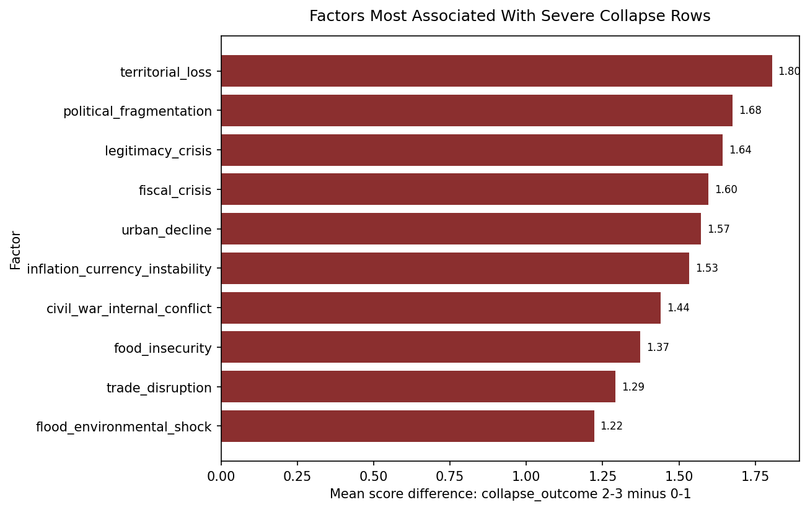
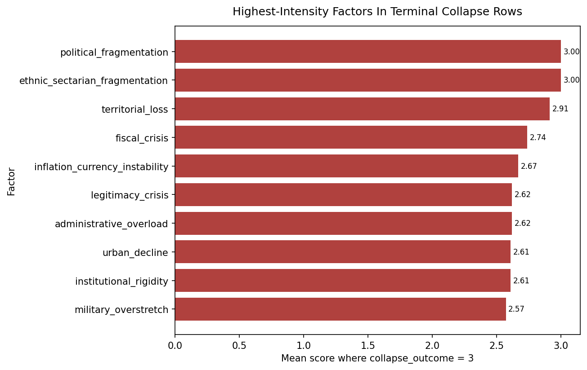
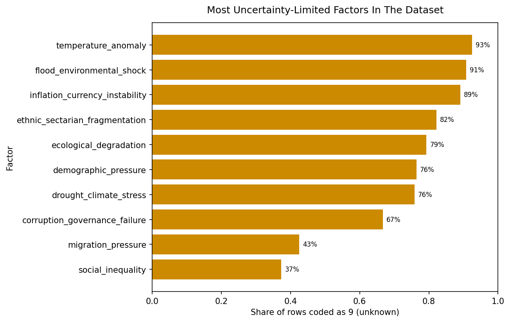
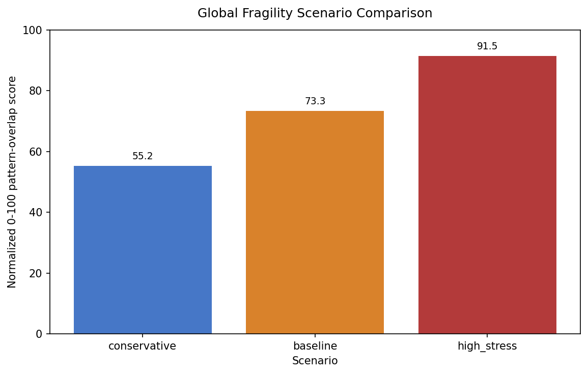

# Collapse Pathways

A comparative historical collapse-pattern analysis project that codes major cases of state, imperial, and regional breakdown into a structured, uncertainty-aware dataset.

## Recommended Review Order

For a first review of the project, open these notebooks in order:

1. `notebooks/12_core_findings_summary.ipynb`
2. `notebooks/15_global_fragility_scored_current_world.ipynb`
3. `notebooks/16_global_fragility_scenarios.ipynb`

## Key Results

- Severe and terminal collapse rows are most strongly associated with `territorial_loss`, `political_fragmentation`, `legitimacy_crisis`, `fiscal_crisis`, and `civil_war_internal_conflict`.
- Terminal-breakdown rows show especially high scores for fragmentation, territorial erosion, fiscal stress, and institutional strain rather than any single monocausal pattern.
- Environmental and demographic variables matter in important cases, but they are also among the most uncertainty-limited parts of the dataset.
- The present-day global extension produces a baseline **Global Fragility Index** of `73.35 / 100`, interpreted as **High fragility** in terms of overlap with historical stress patterns.
- Scenario testing keeps the historical weights fixed and yields a range from **55.25** (`Moderate fragility`) to **91.45** (`Severe systemic stress`), showing that present-day scoring assumptions matter.

## Selected Visuals

### Historical Pattern Signals



Factors that rise most sharply when moving from lower-collapse rows to severe-collapse rows.



Highest-intensity factors within rows coded as terminal collapse or fragmentation.



Most uncertainty-limited factors in the dataset, shown as the share of rows coded `9 = unknown`.

### Global Extension



Scenario comparison for the present-day global fragility extension using fixed historical weights and varying current-world scoring assumptions.

## Project Summary

This repository studies how major historical collapses and severe systemic transformations unfolded across different times and places. The core aim is not to predict apocalypse or automate historical truth claims. It is to build a transparent comparative dataset from literature-based expert interpretation and use it to identify recurring fragility patterns.

## Research Question

Which political, social, economic, environmental, military, and institutional factors recur across major historical collapse cases, which combinations cluster together, and how strongly do those patterns overlap with selected present-day global conditions?

## Why This Project Matters

Historical collapse studies often stay case-specific, while contemporary fragility debates often overreach into prediction. This project sits between those two extremes. It builds a structured comparative dataset that is cautious about uncertainty, explicit about coding rules, and useful for exploratory pattern analysis.

## Dataset Design

- Each row represents one case in one time window.
- Each case is scored on a shared factor framework using `0`, `1`, `2`, `3`, or `9`.
- `9` means unknown, insufficient evidence, debated interpretation, or weak applicability.
- Additional columns track phase, collapse outcome, proximity to collapse, data confidence, source count, and row-level notes.

## Cases Included

- Western Roman Empire
- Bronze Age Collapse States
- Maya
- Akkadian Empire
- Khmer Empire
- Han Dynasty Crisis
- Byzantine Decline
- Sassanian Empire
- Easter Island
- Classic Mesopotamian States
- Ming/Qing Transition
- Aztec Empire
- Inca Empire
- Soviet Union
- Yugoslavia

## Factor Framework

- Political: `political_fragmentation`, `elite_conflict`, `succession_crisis`, `legitimacy_crisis`, `administrative_overload`, `corruption_governance_failure`
- Social: `social_inequality`, `social_unrest_rebellion`, `demographic_pressure`, `migration_pressure`, `ethnic_sectarian_fragmentation`, `urban_decline`
- Economic: `fiscal_crisis`, `taxation_extraction_pressure`, `trade_disruption`, `inflation_currency_instability`, `resource_dependency`, `agricultural_decline`
- Environmental: `drought_climate_stress`, `flood_environmental_shock`, `temperature_anomaly`, `ecological_degradation`, `food_insecurity`
- Military / geopolitical: `external_invasion_pressure`, `civil_war_internal_conflict`, `military_overstretch`, `territorial_loss`
- Institutional / resilience: `institutional_rigidity`, `adaptive_capacity`, `logistics_food_storage_resilience`, `alliance_network_strength`, `recovery_capacity`

## Methodology

1. Gather reputable secondary-literature interpretations for each case.
2. Translate those interpretations into structured factor scores.
3. Code the dataset by case and time window with conservative uncertainty handling.
4. Use exploratory notebooks to examine factor frequency, intensity, co-occurrence, category-level patterns, and uncertainty.
5. Extend the historical framework into a present-day global fragility overlap index without treating it as a collapse prediction model.

## Main Historical Findings

- The strongest factors distinguishing lower-collapse rows from higher-collapse rows are `territorial_loss`, `political_fragmentation`, `legitimacy_crisis`, `fiscal_crisis`, `urban_decline`, and `civil_war_internal_conflict`.
- Terminal-collapse rows are especially associated with high `political_fragmentation`, `territorial_loss`, `fiscal_crisis`, `legitimacy_crisis`, `administrative_overload`, and `institutional_rigidity`.
- Environmental and demographic variables are important in some cases, but they are also among the most uncertainty-limited parts of the dataset.
- Several cases remain highly heterogeneous or debated, especially Bronze Age Collapse States, Easter Island, Maya, Classic Mesopotamian States, and Inca Empire.

## Global Fragility Index Extension

The project includes a present-day extension that converts the historical findings into a **Global Historical Pattern Overlap / Fragility Index**. This is not a forecast of collapse. It is a manual scoring framework that measures how strongly current global conditions overlap with historically recurrent stress patterns.

Current baseline result from the manually entered scoring draft:

- Baseline Global Fragility Index: `73.35 / 100`
- Interpretation band: `High fragility`

## Scenario Analysis Summary

The scenario notebook keeps the historical weights fixed and varies only the present-day scoring assumptions.

- Conservative scenario: `55.25` -> `Moderate fragility`
- Baseline scenario: `73.35` -> `High fragility`
- High-stress scenario: `91.45` -> `Severe systemic stress`

These scenario outputs are sensitivity checks, not predictions.

## Project Structure Overview

```text
Collapse_Pathways/
|-- data/
|   |-- raw/
|   |-- interim/
|   |-- processed/
|   `-- backups/
|-- notebooks/
|-- references/
|   |-- sources/
|   |-- coding_notes/
|   `-- methodology/
|-- reports/
|   `-- figures/
|-- src/
|-- PROJECT_STATUS.md
|-- README.md
`-- requirements.txt
```

## Limitations

- This is a first-pass machine-assisted, literature-based coding draft, not final historical ground truth.
- Some variables are structurally hard to code consistently across very different cases.
- `9` values are meaningful and should not be treated as ordinary numeric zeros.
- The present-day global extension depends on judgment-based scoring and should be interpreted cautiously.

## Suggested Next Steps

- Review high-uncertainty rows case by case against cited sources.
- Refine scenario values factor by factor rather than relying on blanket defaults.
- Add provenance links from coded rows to source notes more systematically.
- Expand category-level and pathway-level comparative analysis.
- Use interpretable models only after the manual review phase is substantially improved.

## Setup

```powershell
python -m venv .venv
.\.venv\Scripts\Activate.ps1
pip install -r requirements.txt
```

## Validation

```powershell
python src\validate_dataset.py
```

## How To Reproduce The Main Results

1. Create and activate the virtual environment, then install `requirements.txt`.
2. Run `python src\validate_dataset.py` to confirm the main dataset is valid.
3. Open `notebooks/12_core_findings_summary.ipynb` for the historical findings.
4. Open `notebooks/15_global_fragility_scored_current_world.ipynb` for the current-world baseline score.
5. Open `notebooks/16_global_fragility_scenarios.ipynb` for the scenario comparison.

## Suggested Starting Points

- `notebooks/12_core_findings_summary.ipynb`
- `notebooks/15_global_fragility_scored_current_world.ipynb`
- `notebooks/16_global_fragility_scenarios.ipynb`
- `reports/final_summary.md`
- `reports/project_map.md`
